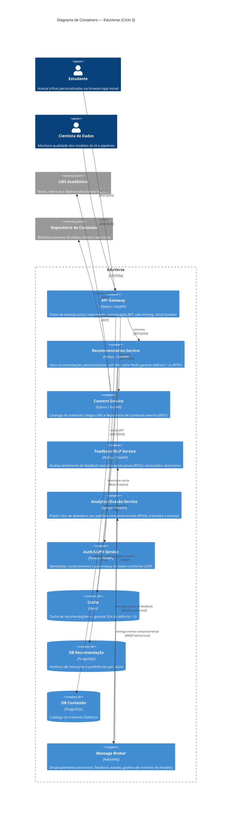

# EduVerse — Plataforma de Aprendizado Adaptativo

> **Dossiê Arquitetural — Ciclo 3: Cloud e Microsserviços**

---

## Visão Executiva

O **EduVerse** é uma plataforma de aprendizado adaptativo movida por Inteligência Artificial
que **rompe com a rigidez do ensino tradicional**: ao invés de forçar todos os alunos ao mesmo
ritmo, o sistema cria trilhas personalizadas, identifica lacunas de conhecimento em tempo real e
provê feedback instantâneo — aumentando retenção e eficácia pedagógica.

| | |
|---|---|
| **Problema** | Educação de ritmo único ignora diferenças individuais; alunos se perdem ou se entediam, elevando evasão. |
| **Solução** | Motor de recomendação com IA (filtragem colaborativa + NLP) + análise de sentimento + predição de evasão. |
| **Fase atual (Ciclo 3)** | Arquitetura evoluída para **Cloud e Microsserviços**: API Gateway, serviços desacoplados, comunicação híbrida síncrona/assíncrona, padrões de resiliência (Circuit Breaker, Bulkhead) e implantação PaaS (Kubernetes gerenciado). |

**Objetivos estratégicos:** Retenção de alunos (CTR > 20%) · Eficácia pedagógica (relevância > 85%) · Operação 24/7 sem downtime · Conformidade LGPD.

---

## Arquitetura de Containers (C4 — Nível 2)



> **Decisões arquiteturais fundamentando este diagrama:**
> - [ADR 0001 — Estratégia de Nuvem e Escalabilidade](docs/adrs/0001-estrategia-nuvem.md)
> - [ADR 0002 — Padrões de Resiliência](docs/adrs/0002-padrao-resiliencia.md)
> - [ADR 0003 — Modelo de Comunicação](docs/adrs/0003-modelo-comunicacao.md)

---

## Documentação Arquitetural

| Artefato | Descrição | Link |
|---|---|---|
| **SAD — Fase 3** | Software Architecture Document completo (arc42): drivers, visões, cenários de qualidade, riscos | [docs/sad/sad-fase3.md](docs/sad/sad-fase3.md) |
| **ADR 0001** | Estratégia de nuvem: PaaS, escalabilidade horizontal, trade-offs IaaS/SaaS | [docs/adrs/0001-estrategia-nuvem.md](docs/adrs/0001-estrategia-nuvem.md) |
| **ADR 0002** | Resiliência: API Gateway + Circuit Breaker + Bulkhead + fallback | [docs/adrs/0002-padrao-resiliencia.md](docs/adrs/0002-padrao-resiliencia.md) |
| **ADR 0003** | Comunicação híbrida: síncrono (recomendação < 2s) + assíncrono (feedback/evasão) | [docs/adrs/0003-modelo-comunicacao.md](docs/adrs/0003-modelo-comunicacao.md) |
| **Ciclo 1** | Visão, requisitos e classificação estratégica "Ousada" | [docs/entrega-ciclo-1.md](docs/entrega-ciclo-1.md) |
| **Gold Plating** | Extras: diagramas adicionais, CI, ADR 0004, Makefile | [gold-plating/README.md](gold-plating/README.md) |

---

## Atributos de Qualidade Prioritários

| Atributo | Meta Mensurável | Tática Arquitetural |
|---|---|---|
| **Performance** | Recomendações em < 2 segundos | Cache Redis + serviço stateless horizontal |
| **Escalabilidade** | Milhares de alunos simultâneos | Escala horizontal (Kubernetes HPA) + broker assíncrono |
| **Usabilidade (XAI)** | Toda recomendação acompanha explicação | Campo `explanation` no contrato do Recommendation Service |
| **Manutenibilidade** | Deploy sem downtime | Rolling update / blue-green; serviços desacoplados |
| **Confiabilidade** | CTR > 20%, disponibilidade 99,9% | Circuit Breaker + fallback para recomendação popular |

---

## Stakeholders Principais

| Papel | Principal Preocupação |
|---|---|
| **Estudante** | Recomendações relevantes e explicadas; fluxo fluido sem esperas |
| **Cientista de Dados** | Qualidade dos dados de treino; ausência de viés; pipelines observáveis |
| **Engenheiro de Segurança** | LGPD: consentimento, anonimização, auditoria; proteção contra *data poisoning* |
| **Gestor de Produto** | Retenção, CTR, custo computacional sustentável |
| **Engenheiro de Negócios** | Conformidade legal, governança, viabilidade de SLA |

---

## Stack Tecnológica

| Camada | Tecnologia |
|---|---|
| Serviços | Python 3.11 + FastAPI |
| Cache | Redis 7 |
| Banco de dados | PostgreSQL 16 (por serviço) |
| Mensageria | RabbitMQ 3.12 |
| Orquestração local | Docker Compose |
| Orquestração produção | Kubernetes (GKE / EKS / AKS — PaaS) |
| CI/CD | GitHub Actions |

---

## Estrutura do Repositório

```
mini-projeto/
├── src/
│   ├── api-gateway/           # API Gateway (FastAPI)
│   ├── recommendation-service/ # Motor de recomendação + XAI
│   └── content-service/        # Catálogo de conteúdo
├── docs/
│   ├── adrs/                  # Architecture Decision Records (0001–0003)
│   ├── sad/                   # Software Architecture Document
│   ├── diagrams/              # Diagramas do Ciclo 1 (C4 N1, swimlanes)
│   └── (docs do Ciclo 1)
├── gold-plating/              # Extras: diagramas, CI, ADR 0004
├── atividades/                # PDFs das atividades semanais
├── docker-compose.yml
├── .env.example
├── Makefile
└── .gitignore
```

---

## Como Rodar Localmente

### Pré-requisitos
- [Docker Desktop](https://www.docker.com/products/docker-desktop/) instalado e em execução
- Git

### 1. Clone o repositório
```bash
git clone https://github.com/Fernando-Oli/mini-projeto.git
cd mini-projeto
```

### 2. Configure variáveis de ambiente
```bash
cp .env.example .env
# edite .env se necessário (as defaults já funcionam localmente)
```

### 3. Suba todos os serviços
```bash
docker compose up --build
```

Ou via Makefile:
```bash
make up
```

### 4. Verifique os serviços

| Serviço | URL | Descrição |
|---|---|---|
| API Gateway | `http://localhost:8080` | Ponto de entrada |
| Health check | `http://localhost:8080/health` | Status de todos os serviços |
| Recomendações | `http://localhost:8080/recommendations?student_id=1` | Fluxo síncrono completo |
| Docs interativa (Gateway) | `http://localhost:8080/docs` | Swagger UI |
| Docs (Recommendation) | `http://localhost:8001/docs` | Swagger UI direto |
| Docs (Content) | `http://localhost:8002/docs` | Swagger UI direto |

### 5. Teste o fluxo principal
```bash
# Health de todos os serviços
curl http://localhost:8080/health

# Recomendações personalizadas com explicação XAI
curl "http://localhost:8080/recommendations?student_id=1"

# Catálogo de conteúdos
curl "http://localhost:8080/content?topic=algebra"
```

### 6. Encerrar
```bash
docker compose down
# ou
make down
```

---

**Aluno:** Fernando Luis Rodrigues de Oliveira | **Matrícula:** 2321056  
**Repositório:** [Fernando-Oli/mini-projeto](https://github.com/Fernando-Oli/mini-projeto)
