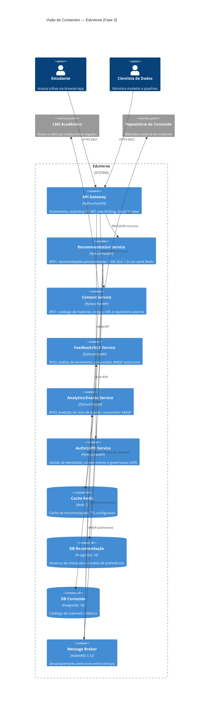

# Software Architecture Document — EduVerse (Fase 3: Cloud e Microsserviços)

**Versão:** 3.0  
**Data:** 2026-06-05  
**Aluno:** Fernando Luis Rodrigues de Oliveira | Matrícula: 2321056  
**Status:** Aprovado

---

## 1. Introdução e Objetivos

### 1.1 Propósito

Este documento descreve a arquitetura de software do **EduVerse** para o Ciclo 3, que
evolui o sistema de uma concepção monolítica/documentada para uma arquitetura de
**cloud e microsserviços** operacionalmente viável.

### 1.2 Escopo

O EduVerse é uma plataforma de aprendizado adaptativo que utiliza IA para criar trilhas
personalizadas de estudo, identificar lacunas de conhecimento em tempo real e prever riscos
de evasão. O sistema conecta estudantes a conteúdos relevantes com base em seu histórico de
desempenho e feedback contínuo.

### 1.3 Drivers Arquiteturais

Derivados do Ciclo 1 (preservados e estendidos):

| Driver | Categoria | Meta |
|---|---|---|
| Recomendações em < 2 segundos | Performance | Latência p99 < 2s no endpoint `/recommendations` |
| Milhares de alunos simultâneos | Escalabilidade | Suportar 10.000 usuários ativos sem degradação |
| XAI — explicar recomendações | Usabilidade | Campo `explanation` em 100% das respostas de recomendação |
| Atualizar modelos sem downtime | Manutenibilidade | Rolling deployment; zero downtime |
| CTR > 20% | Confiabilidade | Taxa medida sobre 3 meses de operação |
| Conformidade LGPD | Segurança | Consentimento, anonimização e auditoria completos |

**Classificação estratégica** (Ciclo 1, mantida): **Ousada** — transição de sistemas
determinísticos para modelos probabilísticos e adaptativos. Como aponta Pressman (2016),
o software é um "transformador de informações" que se deteriora pela complexidade mal
gerida; aqui a arquitetura deve sustentar requisitos emergentes (o sistema aprende com uso).

---

## 2. Restrições

| Restrição | Tipo | Impacto |
|---|---|---|
| LGPD (Lei 13.709/2018) | Legal | Dados de menores exigem consentimento parental; logs com PII devem ser anonimizados |
| Orçamento de cloud | Econômica | Prioriza PaaS gerenciado (menor overhead de ops) sobre IaaS puro |
| Stack Python | Tecnológica | Equipe de IA domina Python; padroniza runtime dos microsserviços |
| Sem downtime em janela escolar | Operacional | Deployments devem ser rolling/blue-green, sem janelas noturnas |
| Latência de inferência ML | Técnica | Modelos de recomendação devem caber em memória (< 500MB) para cold-start rápido |

---

## 3. Contexto e Escopo (C4 — Nível 1)

O diagrama de contexto original (Ciclo 1, `docs/diagrams/diagrama-c4.png`) mostra o
EduVerse como caixa única interagindo com:
- **Estudante** — usuário final
- **Cientista de Dados** — operador dos modelos de IA
- **Engenheiro de Segurança** — garantia de conformidade
- **LMS Acadêmico** — sistema legado de notas
- **Repositório de Conteúdo** — biblioteca externa
- **API de Recomendação** (agora internalizada como microsserviço)

Na Fase 3, a "caixa única" é decomposta em microsserviços conforme Seção 5.

---

## 4. Estratégia de Solução

A estratégia conecta diretamente aos três ADRs obrigatórios:

| Decisão | ADR | Resumo |
|---|---|---|
| **Onde rodar** | [ADR 0001](../adrs/0001-estrategia-nuvem.md) | PaaS (Kubernetes gerenciado) + serverless p/ cargas event-driven; escala horizontal stateless |
| **Como ser resiliente** | [ADR 0002](../adrs/0002-padrao-resiliencia.md) | API Gateway + Circuit Breaker + Bulkhead + fallback para recomendação popular cacheada |
| **Como os serviços conversam** | [ADR 0003](../adrs/0003-modelo-comunicacao.md) | Híbrido: síncrono REST p/ caminho do aluno (< 2s); assíncrono AMQP p/ feedback, evasão, re-treino |

---

## 5. Visão de Containers (C4 — Nível 2)



### Responsabilidades dos containers

| Container | Pattern | Responsabilidade-chave |
|---|---|---|
| API Gateway | Gateway, Facade | Entrada única; protege serviços internos; aplica Circuit Breaker |
| Recommendation Service | Microservice, Cache-Aside | Inferência ML + XAI; retorna lista ranqueada com explicações |
| Content Service | Microservice, Anti-Corruption Layer | Adapta contratos do LMS e repositório externo |
| Feedback/NLP Service | Event Consumer, Worker | Processa sentimento; atualiza pesos de relevância no DB |
| Analytics/Evasão | Event Consumer, Worker | Agrega comportamentos; dispara alertas para tutores |
| Auth/LGPD Service | Security Service | JWT, OAuth2, RBAC, consentimento, logs de auditoria |
| Redis | Cache | Absorve carga do caminho síncrono; evita recomputação frequente |
| RabbitMQ | Message Broker | Desacopla produtor/consumidor; garante entrega com durabilidade |

---

## 6. Visão de Runtime — Cenários Principais

### 6.1 Cenário Síncrono: Estudante solicita recomendações (RF01)

```
Estudante → [HTTPS] → API Gateway
  → verifica JWT no Auth Service
  → consulta Redis: cache HIT? → retorna imediatamente (< 200ms)
  → cache MISS? → chama Recommendation Service
      → busca histórico em DB Recomendação
      → executa inferência ML (filtragem colaborativa)
      → gera explicação XAI
      → armazena resultado em Redis (TTL: 5min)
      → publica evento "interaction.created" no broker
      → retorna lista ranqueada + explicações
  → API Gateway aplica Circuit Breaker:
      → se Recommendation Service falhar → retorna recomendações populares do cache
```

**SLA alvo:** p99 < 2s (cache HIT ~200ms; cache MISS ~1.5s).

### 6.2 Cenário Assíncrono: Processamento de feedback (RF02)

```
Estudante → [HTTPS] → API Gateway → publica "feedback.submitted" no broker
Broker → entrega ao Feedback/NLP Service (assíncrono)
  → analisa sentimento (positivo / negativo / neutro)
  → atualiza peso de relevância do tema no DB Recomendação
  → publica "feedback.processed" (para auditoria/analytics)
```

**Latência tolerada:** até 30s (processamento em background).

### 6.3 Cenário Assíncrono: Predição de evasão (RF03)

```
Analytics Service consome "session.ended" do broker
  → agrega frequência e duração de sessões por aluno
  → executa modelo de predição (regression logística / gradient boosting)
  → se probabilidade_evasão > 0.7 → publica "alerta.evasao" no broker
  → Alert consumer (fora de escopo deste ciclo) notifica tutor
```

---

## 7. Visão de Deployment — Topologia Cloud

### 7.1 Ambiente de Produção (PaaS — Kubernetes Gerenciado)

```
┌─────────────────────────────────────────────────────────────────┐
│  Cloud Provider (GKE / EKS / AKS)                              │
│                                                                 │
│  ┌──────────────────────────────────────────────────────────┐  │
│  │  Kubernetes Cluster                                      │  │
│  │                                                          │  │
│  │  [Ingress Controller / Load Balancer]                    │  │
│  │           │                                              │  │
│  │  ┌────────┴────────────────────────────────────────┐    │  │
│  │  │  api-gateway   (Deployment, 2–N replicas, HPA)  │    │  │
│  │  └────────┬───────────┬──────────────┬─────────────┘    │  │
│  │           │           │              │                   │  │
│  │  ┌────────┴──┐  ┌─────┴──────┐  ┌───┴───────────┐      │  │
│  │  │recommend  │  │  content   │  │  auth/lgpd    │      │  │
│  │  │(HPA 2-10) │  │ (HPA 2-6) │  │  (2 replicas) │      │  │
│  │  └────┬──────┘  └─────┬──────┘  └───────────────┘      │  │
│  │       │               │                                  │  │
│  │  ┌────┴───────────────┴──────────────────────────┐      │  │
│  │  │  Managed Services (cloud-native)               │      │  │
│  │  │  • Cloud Redis (Memorystore / ElastiCache)     │      │  │
│  │  │  • Cloud SQL PostgreSQL (por serviço)          │      │  │
│  │  │  • Managed RabbitMQ (ou Cloud Pub/Sub)         │      │  │
│  │  └───────────────────────────────────────────────┘      │  │
│  │                                                          │  │
│  │  [feedback-service]  [analytics-service]                 │  │
│  │  (Workers, consumidores do broker — escala serverless)   │  │
│  └──────────────────────────────────────────────────────────┘  │
└─────────────────────────────────────────────────────────────────┘
```

### 7.2 Ambiente Local (Docker Compose)

```
docker-compose.yml sobe:
  • api-gateway    → porta 8080
  • recommendation-service → porta 8001
  • content-service        → porta 8002
  • redis                  → porta 6379
```

Os serviços `feedback`, `analytics` e `auth` são documentados na arquitetura mas não
fazem parte do scaffold executável mínimo (ver `src/`).

---

## 8. Decisões Arquiteturais (Links)

| ADR | Título | Status |
|---|---|---|
| [ADR 0001](../adrs/0001-estrategia-nuvem.md) | Estratégia de Nuvem e Escalabilidade | Aceito |
| [ADR 0002](../adrs/0002-padrao-resiliencia.md) | Padrões de Resiliência | Aceito |
| [ADR 0003](../adrs/0003-modelo-comunicacao.md) | Modelo de Comunicação | Aceito |
| [ADR 0004](../../gold-plating/0004-estrategia-observabilidade.md) | Estratégia de Observabilidade | Aceito (Gold Plating) |

---

## 9. Cenários de Atributos de Qualidade

Seguindo o modelo de Bass, Clements e Kazman (2012) — estímulo, artefato, ambiente, resposta, medida de resposta:

### 9.1 Performance

| Campo | Valor |
|---|---|
| Fonte | Estudante (1.000 simultâneos) |
| Estímulo | Requisição de recomendação personalizada |
| Artefato | Recommendation Service |
| Ambiente | Operação normal (cache MISS) |
| Resposta | Retorna lista ranqueada com explicações XAI |
| Medida | p99 latência < 2 segundos |
| **Tática** | **Cache-Aside (Redis) + instâncias stateless escaladas horizontalmente** |

### 9.2 Escalabilidade

| Campo | Valor |
|---|---|
| Fonte | Início do semestre letivo (pico de acesso) |
| Estímulo | 10.000 usuários ativos simultâneos |
| Artefato | Cluster Kubernetes |
| Ambiente | Carga crescente em 10 minutos |
| Resposta | Sistema mantém disponibilidade sem degradação |
| Medida | Tempo de resposta p99 < 3s; taxa de erro < 0,1% |
| **Tática** | **Horizontal Pod Autoscaler (HPA) + broker absorve picos assíncronos** |

### 9.3 Disponibilidade / Resiliência

| Campo | Valor |
|---|---|
| Fonte | Falha no Recommendation Service (instância única) |
| Estímulo | Timeout na chamada de inferência ML |
| Artefato | API Gateway + Circuit Breaker |
| Ambiente | Operação com 1 instância do Recommendation Service falhando |
| Resposta | Gateway abre o circuito e retorna recomendações populares cacheadas |
| Medida | Degradação graceful em < 500ms; circuito reabre após 30s |
| **Tática** | **Circuit Breaker + fallback + Bulkhead (pool isolado de inferência)** |

---

## 10. Riscos e Dívidas Técnicas

| Risco / Dívida | Impacto | Mitigação |
|---|---|---|
| Viés (bias) no modelo de recomendação | Alto — recomendações discriminatórias | Pipeline de monitoramento de fairness; auditoria mensal pelo Cientista de Dados |
| Cold-start do modelo ML | Médio — primeiros alunos sem histórico | Estratégia de fallback: recomendações editorialmente curadas |
| Lock-in com cloud provider | Médio — custo de migração elevado | Abstrações via Kubernetes; mensageria plugável (AMQP padrão) |
| Broker como SPOF | Alto — falha derruba fluxo assíncrono | RabbitMQ em cluster HA; retry com backoff exponencial |
| LGPD: dados de treino | Alto — risco legal e reputacional | Anonimização antes de qualquer exportação; consentimento explícito |
| Dívida: feedback e evasão não executáveis | Baixo (Ciclo 3) | Evoluir scaffold no Ciclo 4 |

---

## 11. Glossário

| Termo | Definição |
|---|---|
| **XAI** | Explainable AI — capacidade do modelo de justificar suas recomendações em linguagem natural |
| **CTR** | Click-Through Rate — proporção de recomendações clicadas/acessadas pelo estudante |
| **Circuit Breaker** | Padrão de resiliência que interrompe chamadas a um serviço instável (Nygard, 2007) |
| **Bulkhead** | Padrão que isola pools de recursos para evitar falha em cascata (Nygard, 2007) |
| **HPA** | Horizontal Pod Autoscaler — mecanismo Kubernetes de escala automática por réplicas |
| **AMQP** | Advanced Message Queuing Protocol — protocolo padrão do RabbitMQ |
| **PaaS** | Platform as a Service — modelo cloud em que o provedor gerencia infraestrutura de runtime |
| **LGPD** | Lei Geral de Proteção de Dados (Lei 13.709/2018) |
| **LMS** | Learning Management System — sistema legado de gestão acadêmica |

---

## Referências

- BASS, L.; CLEMENTS, P.; KAZMAN, R. *Software Architecture in Practice*. 3. ed. Addison-Wesley, 2012.
- FOWLER, M. *Patterns of Enterprise Application Architecture*. Addison-Wesley, 2002.
- HOHPE, G.; WOOLF, B. *Enterprise Integration Patterns*. Addison-Wesley, 2003.
- NEWMAN, S. *Building Microservices*. 2. ed. O'Reilly Media, 2021.
- NIST SP 800-145. *The NIST Definition of Cloud Computing*. 2011.
- NYGARD, M. T. *Release It! Design and Deploy Production-Ready Software*. 2. ed. Pragmatic Bookshelf, 2018.
- PRESSMAN, R. S. *Engenharia de Software: Uma Abordagem Profissional*. 8. ed. McGraw-Hill, 2016.
- RICHARDSON, C. *Microservices Patterns*. Manning Publications, 2018.
