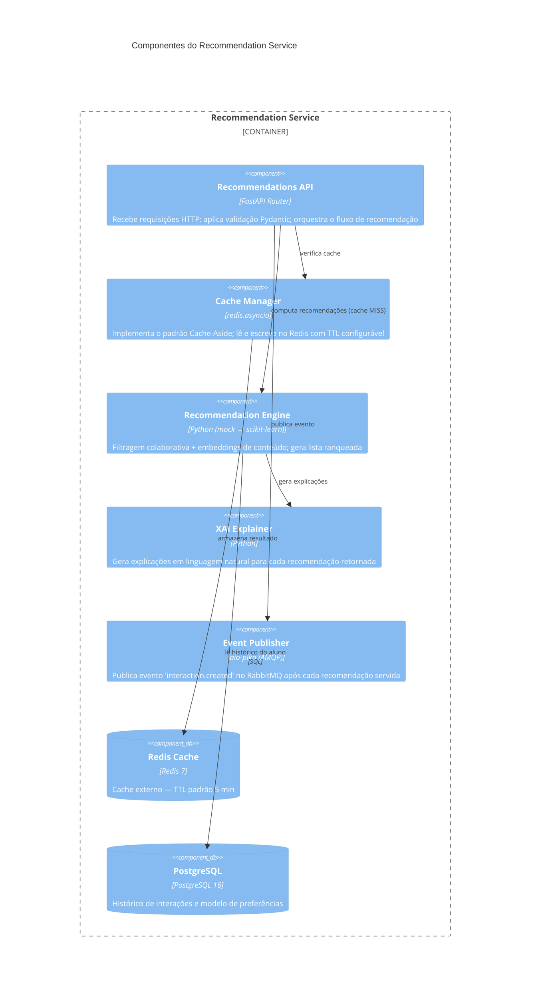
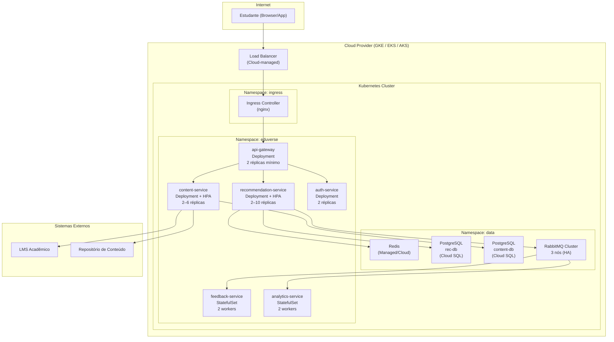
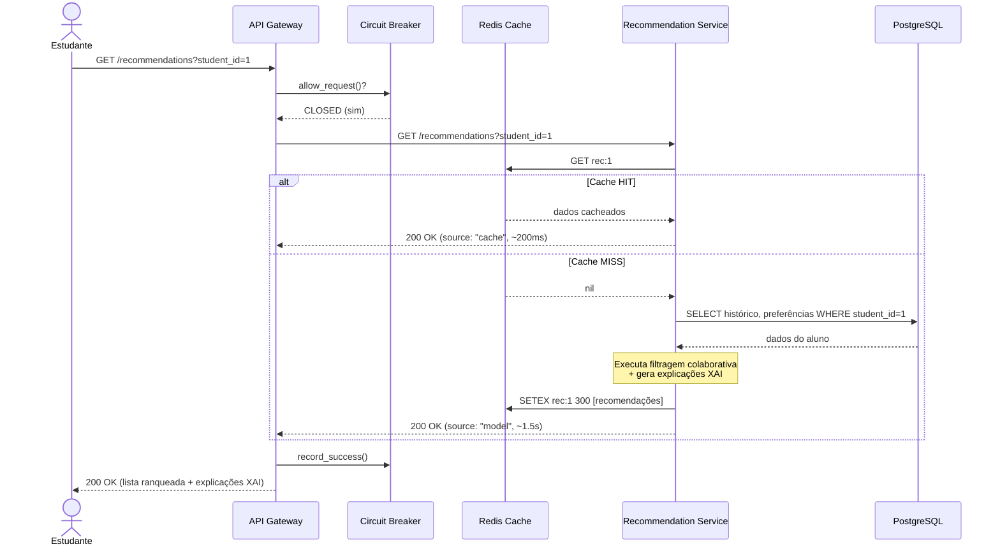
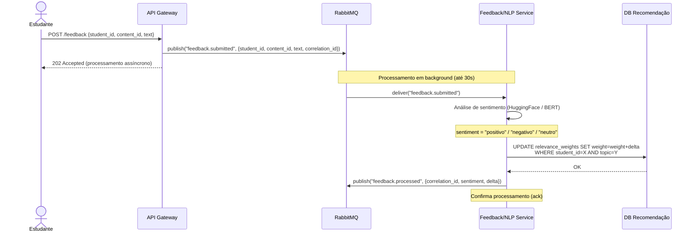
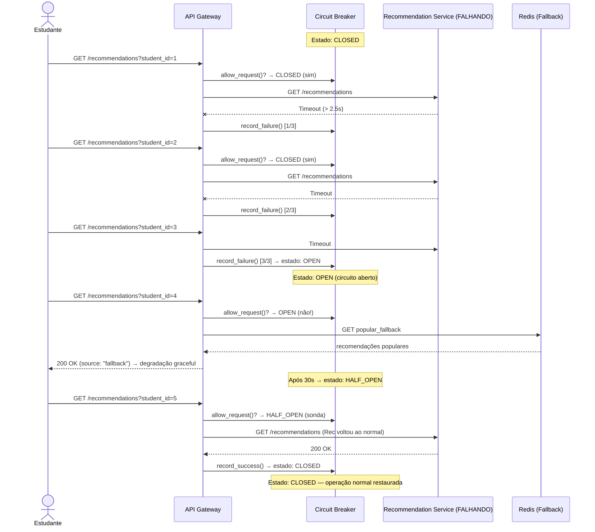

# Diagramas Arquiteturais Extras — EduVerse (Fase 3)

Estes diagramas complementam o C4 de Containers do README com níveis de detalhe adicionais.

---

## 1. C4 — Nível 3: Componentes do Recommendation Service

---

## 2. Diagrama de Deployment — Topologia Cloud (Kubernetes)

---

## 3. Diagrama de Sequência — Fluxo Síncrono de Recomendação (RF01)

---

## 4. Diagrama de Sequência — Fluxo Assíncrono de Feedback (RF02)

---

## 5. Diagrama de Sequência — Circuit Breaker em Ação (ADR 0002)

